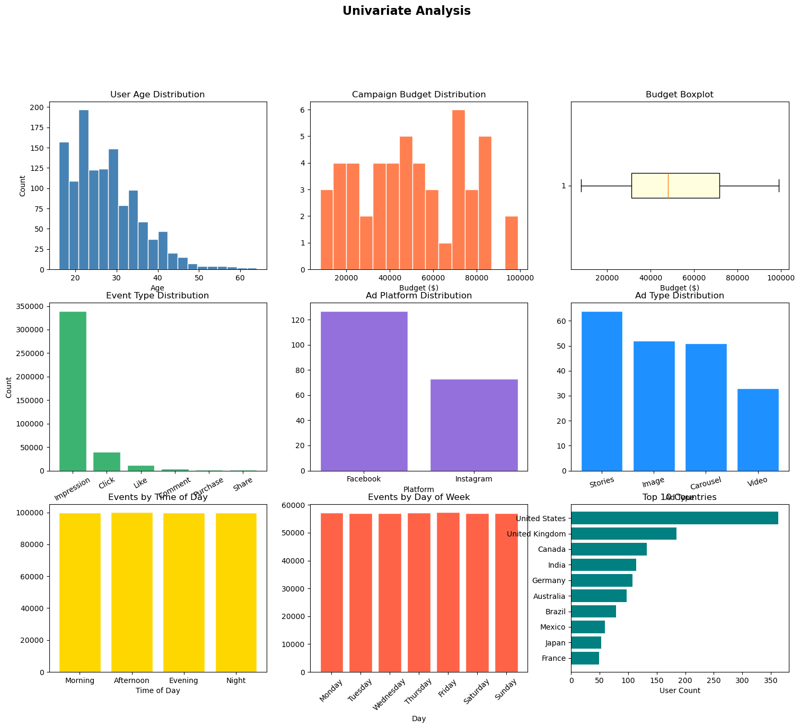
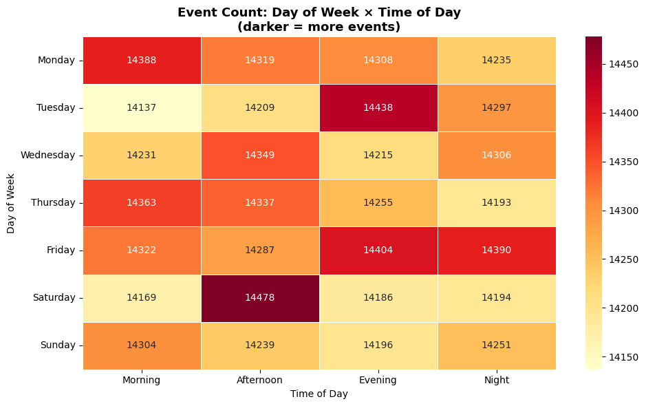

# 📊 SocialAds 360 Dashboard — Meta Ad Performance Analysis


> **Business Intelligence dashboard analyzing 400K+ Meta ad events using Power BI, Excel & DAX.**

🌐 **Dataset:** [Social Media Advertisement Performance — Kaggle](https://www.kaggle.com/datasets/alperenmyung/social-media-advertisement-performance) &nbsp;|&nbsp; 👩‍💻 

---

## 🖼️ Dashboard Preview

### 📘 Facebook Ad Analysis


### 📸 Instagram Ad Analysis


### 📊 Univariate Analysis


### 🗓️ Event Count: Day of Week × Time of Day


---

## 📋 Table of Contents

- [What This Does](#-what-this-does)
- [Real Numbers](#-real-numbers)
- [Dataset](#-dataset)
- [Key Metrics Explained](#-key-metrics-explained)
- [Tech Stack](#-tech-stack)
- [Folder Structure](#-folder-structure)
- [Project Status](#-project-status)
- [Author](#-author)

---

## 💡 What This Does

End-to-end Business Intelligence pipeline on real Meta (Facebook + Instagram) ad campaign performance data covering **400K+ ad events**.

1. **Problem** — No unified view of Meta ad performance across platforms — no way to compare CTR, ROAS, or ROI across Facebook and Instagram in one place
2. **Solution** — Full analytics pipeline from raw ad event data → EDA → audience segmentation → cross-platform Power BI dashboard
3. **For** — Data Analyst / BI Analyst / Marketing Analyst hiring managers looking for real ad analytics proof

---

## 📈 Real Numbers

| Metric | Value |
|--------|-------|
| Total Ad Events Analyzed | 400K+ |
| Platforms Covered | Facebook, Instagram |
| Key KPIs Tracked | CTR, CPC, CPM, ROAS, ROI, Conversions, Engagement Rate |
| Analysis Types | EDA, Audience Segmentation, A/B Testing, Attribution |
| ML Applied | KMeans Audience Clustering |
| Dashboard | Power BI with DAX measures |
| Excel Analysis | Pivot Tables + VBA Automation |
| Total Budget Tracked | $2.54M |

---

## 🗃️ Dataset

| Field | Detail |
|-------|--------|
| Source | [Social Media Advertisement Performance — Kaggle](https://www.kaggle.com/datasets/alperenmyung/social-media-advertisement-performance) |
| Platforms | Facebook, Instagram |
| Features | Ad Type, Platform, Spend, Impressions, Clicks, Conversions, CTR, CPC, CPM, ROAS, ROI |
| Use Case | Cross-platform attribution, budget optimization, audience targeting |

---


## 📐 Key Metrics Explained

| Metric | Formula | What It Tells You |
|--------|---------|-------------------|
| CTR | Clicks / Impressions × 100 | Ad relevance and engagement |
| CPC | Spend / Clicks | Cost efficiency per click |
| CPM | Spend / Impressions × 1000 | Cost to reach 1,000 people |
| ROAS | Revenue / Ad Spend | Revenue generated per $1 spent |
| ROI | (Revenue - Spend) / Spend × 100 | Profit percentage on ad spend |
| Conversion Rate | Conversions / Clicks × 100 | Quality of traffic driven |
| Engagement Rate | Engagements / Impressions × 100 | Audience interaction level |

---

## 🛠️ Tech Stack

| Tool | Purpose |
|------|---------|
| Python 3.11 | Core language |
| Pandas + NumPy | Data cleaning and manipulation |
| Matplotlib + Seaborn | Static EDA charts |
| Scikit-learn | KMeans audience segmentation |
| Power BI (DAX) | Cross-platform BI dashboard |
| Microsoft Excel + VBA | Pivot tables + automated reports |
| SQL | Data querying |
| Git | Version control |

---

## 📁 Folder Structure

```
meta ad performance analysis - BI/
│   .gitignore
│   README.md
│
├───BUSINESS INSIGHTS
│       BRD_Meta_Ad_Performance.pdf
│
├───data
│   ├───processed
│   │       ad_metrics_clustered.csv
│   └───raw
│           ads.csv
│           campaigns.csv
│
├───ms excel Dashboard
│       DASHBOARD_EXCEL.pdf
│       meta_ad_analysis (version 1).xlsb
│       pivot_charts_! (1).png
│       pivot_charts_! (2).png
│       readiness_report.png
│       summary.png
│       VBA_coding_pivot.png
│       VBA_Coding_summary_report.png
│
├───notebooks
│       ad_analysis.ipynb
│       meta_analysis.py
│
├───PLOTS
│       adtype_performance.png
│       bivariate_analysis.png
│       campaign_level_analysis.png
│       campaign_performance.png
│       click_rate_time_patterns.png
│       cluster_comparison.png
│       correlation_heatmap.png
│       day_of_week_events.png
│       demographic_analysis.png
│       elbow_silhouette_kmeans.png
│       event_type_distribution.png
│       pca_2d_scatter.png
│       platform_event_analysis.png
│       target_audience_performance.png
│       time_based_patterns.png
│       univariate_analysis.png
│       weekly_trend.png
│
└───power bi Dashboard
        facebook ad analysis.png
        instagram ad analysis.png
        Meta_Ad_Performance_BI_Report.docx
        tooltip.png
```

---

## ✅ Project Status

| Deliverable | Status |
|-------------|--------|
| Data Cleaning | ✅ Complete |
| EDA | ✅ Complete |
| Audience Segmentation (KMeans) | ✅ Complete |
| Power BI Dashboard | ✅ Complete |
| Excel Dashboard + VBA | ✅ Complete |
| Business Insights Report (BRD) | ✅ Complete |
| SQL Queries | ✅ Complete |
| GitHub Repository | ✅ Complete |

---

## 🔗 Links

| Resource | URL |
|----------|-----|
| 📊 Dataset | [Social Media Advertisement Performance — Kaggle](https://www.kaggle.com/datasets/alperenmyung/social-media-advertisement-performance) |


---

> *"400K+ ad events. Every click tracked. This is what real Meta ad analytics looks like."*

